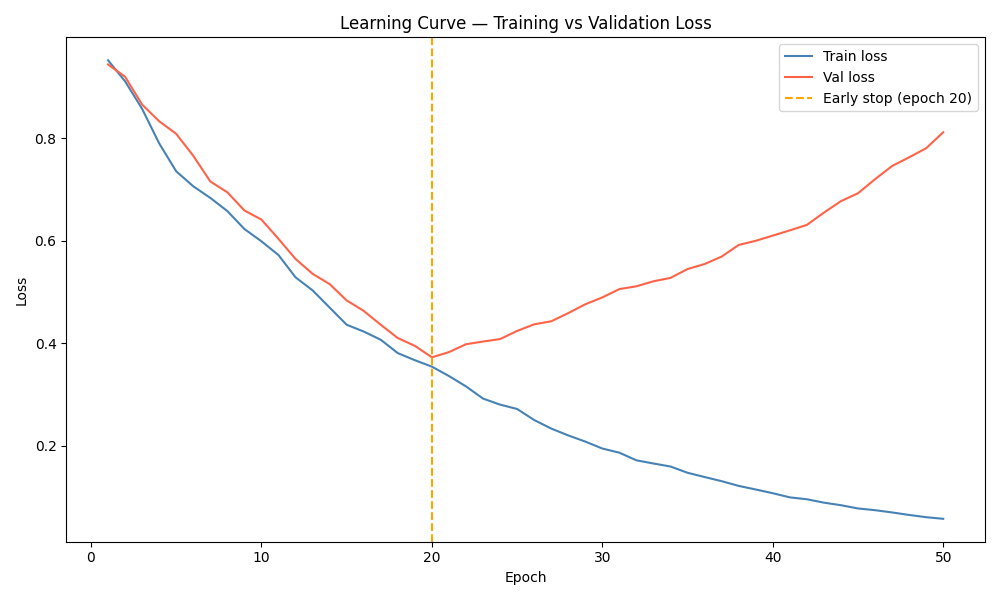

# Training Log Analyser

A Python tool that parses ML model training logs, detects overfitting, and plots 
learning curves with early stopping recommendations.

---

## The problem

A model's training loss can keep falling while its validation loss silently climbs — 
meaning the model is memorising training data instead of learning from it. Left 
unchecked, this produces a model that performs brilliantly on data it has seen and 
fails on data it hasn't.

Training Log Analyser catches this automatically and tells you exactly which epoch 
to stop at.

---

## Quickstart
```bash
git clone https://github.com/nightingaletech/training-log-analyser.git
cd training-log-analyser
pip install matplotlib
python generate_log.py
python analyser.py --file training_log.csv
```

---

## Example output
```
============================
  TRAINING LOG REPORT
  50 epochs
============================

FINAL METRICS (epoch 50)
  Train loss    0.0572
  Val loss      0.8115
  Train acc     92.5%
  Val acc       20.2%

OVERFIT DETECTION
  ⚠ Overfitting detected from epoch 20
  Best val loss: 0.3723 at epoch 20
  Recommendation: use early stopping at epoch 20

============================
  Chart saved → learning_curve.png
```

---

## Learning curve



---

## Configuration

Edit `config.py` to point at your own training log:

| Setting | Default | Description |
|---|---|---|
| `DATA_PATH` | `training_log.csv` | Path to your training log CSV |
| `PATIENCE` | `5` | Epochs with no improvement before flagging overfitting |

Your CSV must have these columns: `epoch`, `train_loss`, `val_loss`, `train_acc`, `val_acc`.

---

## Generating synthetic data

If you don't have a real training log, use the included generator:
```bash
python generate_log.py
```

This creates `training_log.csv` with 50 epochs and deliberate overfitting built 
in from epoch 20 — so you can verify the tool catches what it should.

---

## Why this matters for AI safety

Overfitting is one of the most common causes of model failure in production. A 
model evaluated only on training metrics can appear highly capable while being 
nearly useless on real-world data. Catching it early — before deployment — is a 
basic requirement for responsible ML development.

---

## Roadmap

- [ ] Accuracy curve alongside loss curve
- [ ] HTML report with embedded chart
- [ ] Support for JSON log format (Keras, PyTorch)
- [ ] Automatic hyperparameter suggestions based on curve shape

---

## License

MIT
